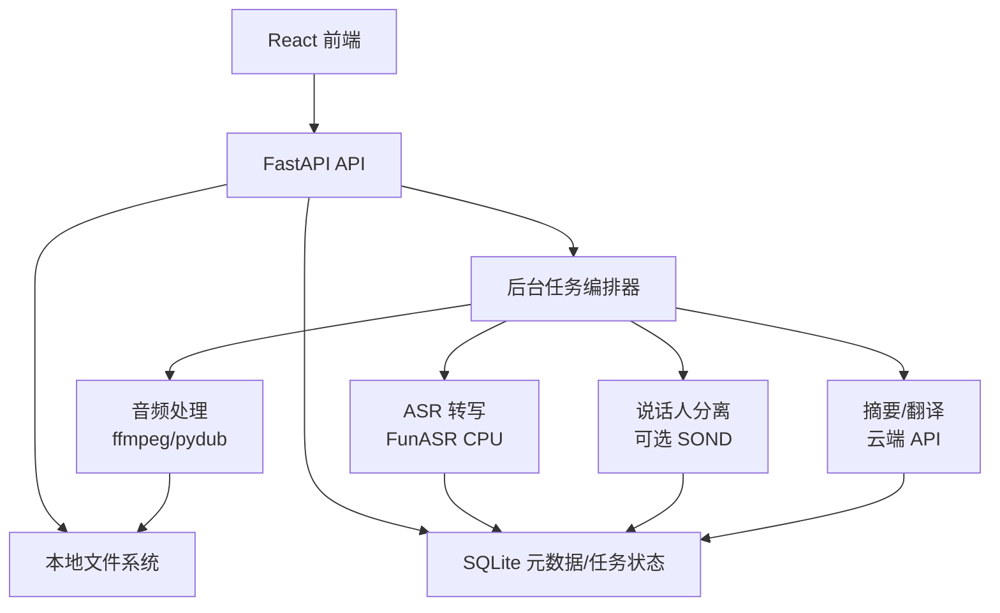

## 产品目标与部署边界

在本地 Windows 环境下部署一套 AI 录音卡系统，核心链路包括音频导入、格式处理、离线语音转写、说话人分离、文字同步播放、摘要/纪要/待办生成和翻译。

部署边界需要明确：**音频文件、转写结果、元数据和任务状态均本地保存；AI 摘要与翻译默认调用云端大模型 API**（DeepSeek / 通义千问 / 小米 MiMo），因此该方案不是严格意义上的“全链路离线”。如果后续要求完全离线，可再切换到本地小模型或 Ollama，但这会显著提高部署成本和推理耗时。

## 部署结论

优先采用 **Windows 原生部署 + 模块化单体后端 + 本地 SQLite + 本地文件系统**。

不建议第一版就拆成多个独立微服务，也不建议第一版强依赖 Docker。当前设备没有 NVIDIA GPU/CUDA，ASR 主要走 CPU；系统复杂度应该先服务于“稳定跑通录音转写和摘要”，等核心链路稳定后再拆分服务或加入 AMD GPU 加速。

经当前机器复核后，最优路线仍然是：**Python 3.12 + PyTorch CPU + FunASR Paraformer-zh + FastAPI 模块化单体 + React/Vite 前端 + 云端 LLM 摘要**。这条路线比 Docker、多微服务、本地大模型或 CUDA/DirectML 优先路线更适合当前硬件和安装状态。

推荐落地顺序：

1. MVP：音频上传/导入 -> 格式转换 -> FunASR 离线转写 -> 云端摘要 -> 前端展示。
2. 增强：说话人分离、转写编辑、文字同步播放、标签与搜索。
3. 体验：实时转写 WebSocket、批量任务、断点续跑、摘要模板。
4. 性能：ONNX Runtime + DirectML、模型缓存、任务并发控制。

## 当前设备环境

| 项目 | 详情 | 部署判断 |
| --- | --- | --- |
| CPU | AMD Ryzen 9 6900HX（8 核 16 线程） | 可承担 CPU ASR 推理 |
| 内存 | 31.25GB 可用物理内存级别 | 足够运行后端、前端和 1-2 个 ASR 模型 |
| GPU | AMD Radeon 集成显卡，非 NVIDIA，无 CUDA | 不走 CUDA；DirectML 仅作为后续优化 |
| Vulkan | 1.3.246 | 可保留，不作为第一版依赖 |
| Python | 当前 `py` 仅发现 Python 3.14.4 | **必须新增 Python 3.12.x**，再创建项目虚拟环境 |
| Node.js | 当前 `node` 指向 Codex 应用内置 Node 24.14.0，但访问受限；`npm` 不存在 | **必须安装独立 Node.js LTS**，不能依赖 Codex 内置 node |
| ffmpeg | 8.1 | 可直接复用 |
| 磁盘 | C 盘剩余约 732GB | 足够存放模型、音频和转写结果 |

### 当前机器检查结论

1. **CPU/内存足够，GPU 不适合做第一版加速**：Ryzen 9 6900HX + 32GB 内存适合 CPU ASR；AMD 集显显存较小，DirectML 可实验但不应进入 P0。
2. **Python 3.14 不是可落地运行时**：当前机器没有 Python 3.12，而 PyTorch Windows 官方二进制包更稳妥的支持范围是 Python 3.9-3.12，因此部署前应先安装 Python 3.12。
3. **Node.js 状态不是“已安装可用”**：当前命令解析到 Codex 应用目录下的 node.exe，且执行被拒绝，npm 也不存在。前端开发必须安装独立 Node.js 24 LTS，并确认 `node -v` 和 `npm -v` 都来自独立安装目录。
4. **ffmpeg 已满足要求**：当前 ffmpeg 8.1 可用，音频格式转换不需要额外处理。
5. **磁盘空间充足**：C 盘约 732GB 可用，足够模型缓存和本地音频数据。

## 运行时版本策略

### Python

后端不要使用系统 Python 3.14。FunASR、PyTorch、torchaudio 等音频/深度学习依赖对 Python 版本较敏感，推荐单独安装并固定：

- 推荐：Python 3.12.x 64-bit
- 可尝试：Python 3.13.x，仅在 PyTorch/FunASR 安装和导入测试通过后使用
- 不建议：Python 3.14.x

后端统一使用项目内虚拟环境：

```powershell
cd c:\Users\13318\WorkBuddy\20260425144009\backend
py -3.12 -m venv .venv
.\.venv\Scripts\Activate.ps1
python -m pip install --upgrade pip setuptools wheel
```

### Node.js

前端安装独立 Node.js LTS。新项目优先使用 Node.js 24 LTS；如果前端依赖或脚手架对新版本支持不足，则使用 Node.js 22 LTS。

注意：当前机器已有一个来自 Codex 应用目录的 `node.exe` 被 PATH 命中，但它不可作为项目开发环境使用。安装 Node.js 后需要确认 `where node` 指向独立安装目录，例如 `C:\Program Files\nodejs\node.exe`，并确认 `npm` 可用。

```powershell
node -v
npm -v
```

### ffmpeg

ffmpeg 已安装，只需在启动脚本中检查：

```powershell
ffmpeg -version
```

## 技术栈优化

| 层级 | 推荐方案 | 优化原因 |
| --- | --- | --- |
| 后端 | FastAPI + Uvicorn | Windows 本地部署简单，API 和 WebSocket 都够用 |
| 后台任务 | 第一版使用进程内任务队列 + SQLite 持久化任务状态 | 避免第一版引入 Redis/Celery 的部署成本 |
| ASR | FunASR + PyTorch CPU | 当前设备无 CUDA，CPU 路线最稳 |
| 默认 ASR 模型 | Paraformer-zh + fsmn-vad + ct-punc + 时间戳模型 | 更适合中文会议转写和文字同步高亮 |
| 多语种/情感识别模型 | SenseVoice-Small | 作为可选模式，适合中英日韩/粤语、语种识别、情感和声学事件 |
| 高精度 ASR | Paraformer-large | 作为设置项，不作为默认 |
| 说话人分离 | FunASR SOND，作为可选增强 | CPU 推理较慢，避免拖慢 MVP |
| 摘要/翻译 | DeepSeek / 通义千问 / 小米 MiMo OpenAI-compatible API 封装 | 避免本地 LLM 部署压力，支持多供应商切换 |
| 音频处理 | ffmpeg + pydub | 格式转换、切片、时长计算稳定 |
| 数据库 | SQLite + SQLModel | 单机应用足够，迁移成本低 |
| 文件存储 | 本地 data 目录 | 音频和转写文件无需进数据库 |
| 前端 | React + TypeScript + Tailwind CSS + shadcn/ui | 快速实现可维护的桌面式 Web UI |

## 架构优化

第一版采用“模块化单体”，而不是物理拆分微服务：



这样部署时只需要启动两个进程：

1. 后端：FastAPI
2. 前端：Vite/React

后续如果要扩展，再把 ASR worker、LLM worker、WebSocket gateway 拆出去。

## 推荐目录结构

```text
c:/Users/13318/WorkBuddy/20260425144009/
├── backend/
│   ├── app/
│   │   ├── main.py
│   │   ├── config.py
│   │   ├── api/
│   │   ├── db/
│   │   ├── models/
│   │   ├── pipeline/
│   │   └── services/
│   ├── requirements.txt
│   ├── start.ps1
│   └── .env.example
├── frontend/
│   ├── package.json
│   ├── src/
│   └── vite.config.ts
├── models/
│   ├── funasr/
│   └── README.md
├── data/
│   ├── recordings/
│   ├── normalized/
│   ├── transcripts/
│   ├── summaries/
│   └── app.db
├── logs/
├── docs/
│   ├── deployment-guide.md
│   └── api-reference.md
├── start-all.ps1
└── README.md
```

关键调整：

- `models/` 专门存模型缓存，不提交 Git。
- `data/recordings/` 存原始音频。
- `data/normalized/` 存转换后的 wav/16k 音频，便于 ASR 重试。
- `data/transcripts/` 和 `data/summaries/` 存导出的 JSON/Markdown。
- `logs/` 存后端和任务日志，方便排错。
- `.env.example` 提供配置模板，真实 `.env` 不提交。

## 环境变量设计

```env
APP_ENV=local
APP_HOST=127.0.0.1
APP_PORT=8000

DATA_DIR=../data
MODEL_DIR=../models/funasr
LOG_DIR=../logs

ASR_DEVICE=cpu
ASR_MODEL=paraformer-zh
ASR_VAD_MODEL=fsmn-vad
ASR_PUNC_MODEL=ct-punc
ASR_TIMESTAMP_MODEL=fa-zh
ASR_ENABLE_DIARIZATION=false
ASR_MAX_CONCURRENCY=1

LLM_PROVIDER=deepseek
LLM_API_KEY=
LLM_BASE_URL=
LLM_MODEL=
LLM_MAX_COMPLETION_TOKENS=2048
LLM_TEMPERATURE=
LLM_TOP_P=

# 小米 MiMo 可选配置：
# LLM_PROVIDER=mimo
# MIMO_API_KEY=your_mimo_api_key
# MIMO_THINKING=disabled
MIMO_API_KEY=
MIMO_THINKING=disabled

CORS_ORIGINS=http://localhost:5173
```

建议第一版把 `ASR_MAX_CONCURRENCY` 固定为 1，避免多个长音频同时转写导致 CPU 和内存被打满。

## 后端部署步骤

```powershell
cd c:\Users\13318\WorkBuddy\20260425144009\backend
py -3.12 -m venv .venv
.\.venv\Scripts\Activate.ps1
python -m pip install --upgrade pip setuptools wheel
pip install -r requirements.txt
copy .env.example .env
uvicorn app.main:app --host 127.0.0.1 --port 8000 --reload
```

`requirements.txt` 建议先分层：

```text
fastapi
uvicorn[standard]
sqlmodel
pydantic-settings
python-multipart
httpx
openai
pydub
soundfile
numpy
funasr
modelscope
torch
torchaudio
```

如果 PyTorch 安装失败，优先按 PyTorch 官方 CPU 安装命令单独安装 `torch` 和 `torchaudio`，再安装其余依赖。

## 前端部署步骤

```powershell
cd c:\Users\13318\WorkBuddy\20260425144009\frontend
npm install
npm run dev
```

前端 `.env.local`：

```env
VITE_API_BASE_URL=http://127.0.0.1:8000
VITE_WS_BASE_URL=ws://127.0.0.1:8000
```

## 一键启动脚本

根目录增加 `start-all.ps1`，职责只做启动，不在每次启动时自动安装大依赖：

```powershell
$Root = Split-Path -Parent $MyInvocation.MyCommand.Path

Start-Process powershell -ArgumentList "-NoExit", "-Command", "cd '$Root\backend'; .\.venv\Scripts\Activate.ps1; uvicorn app.main:app --host 127.0.0.1 --port 8000"
Start-Process powershell -ArgumentList "-NoExit", "-Command", "cd '$Root\frontend'; npm run dev"
```

依赖安装建议放到 `setup.ps1`，避免启动脚本不可控地修改环境。

## 任务流水线

上传音频后进入统一任务状态机：

```text
uploaded
  -> normalizing
  -> transcribing
  -> diarizing(optional)
  -> summarizing
  -> completed
  -> error
```

每个阶段都写入 SQLite：

- 当前状态
- 进度百分比
- 错误信息
- 输入文件路径
- 输出文件路径
- 开始/结束时间

这样即使后端中途退出，也可以在下次启动后展示失败状态，并允许用户重试。

## 模型下载策略

第一版采用“首次使用时下载 + 本地缓存”的方式，不把模型放进安装包。

建议：

- 默认模型：Paraformer-zh + fsmn-vad + ct-punc + fa-zh，用于中文/中英混合会议转写和时间戳同步
- 可选模型：SenseVoice-Small，用于多语种、语种识别、情感识别和声学事件检测
- 高精度模型：Paraformer-large，设置页中手动启用
- 说话人分离模型：首次启用说话人分离时再下载

启动时只检查 `MODEL_DIR` 是否可写，不强制下载全部模型。

## 验收标准

MVP 验收以可运行结果为准：

1. 后端 `GET /health` 返回正常。
2. 前端可以打开录音管理页。
3. 可以上传 wav/mp3/m4a 文件。
4. 后端能转换为 ASR 友好的 wav 格式。
5. 5 分钟中文音频可完成转写。
6. 转写结果包含文本和时间戳。
7. 可以调用云端 API 生成摘要。
8. 录音、转写、摘要刷新页面后仍存在。
9. 转写失败时能显示错误并允许重试。
10. API Key 不出现在前端打包产物和日志中。

## 性能预期

在当前 CPU 环境下，建议按保守预期设计用户体验：

- 5 分钟音频：约 1-3 分钟完成转写。
- 30 分钟音频：约 5-12 分钟完成转写。
- 1 小时音频：约 10-25 分钟完成转写。
- 摘要：取决于云端 API 和文本长度，通常几十秒内完成。

前端不要假设任务会很快完成，应提供后台任务列表、进度条、错误详情和重试按钮。

## 风险与兜底

| 风险 | 表现 | 兜底策略 |
| --- | --- | --- |
| Python/PyTorch 版本不兼容 | 依赖安装失败、import torch 失败 | 切换 Python 3.12 虚拟环境 |
| ASR CPU 过慢 | 长音频等待时间长 | 默认轻量模型、限制并发、支持后台任务 |
| 说话人分离慢 | 会议音频处理耗时过长 | 作为可选开关，不阻塞基础转写 |
| 云端 API 失败 | 摘要/翻译失败 | 保存转写结果，允许单独重试摘要 |
| API Key 泄露 | 前端或日志出现密钥 | Key 只存后端 `.env`，日志脱敏 |
| 模型下载慢 | 首次转写等待久 | UI 显示“模型准备中”，支持重试 |
| 大文件上传卡顿 | 上传超时或内存占用高 | 限制单文件大小，后续支持分片上传 |

## 实施优先级

### P0：必须先完成

- 后端项目结构、配置加载、日志目录。
- SQLite 表：recordings、tasks、transcript_segments、summaries。
- 音频上传、格式校验、ffmpeg 转换。
- FunASR 离线转写。
- 云端摘要调用。
- 前端录音列表、详情页、任务进度。

### P1：核心增强

- 文字同步播放。
- 转写文本编辑。
- 说话人分离。
- 标签、搜索、删除。
- 摘要模板：全文摘要、待办、会议纪要、语篇规整。

### P2：体验与性能

- WebSocket 实时进度。
- 批量导入。
- DirectML/ONNX 加速实验。
- 导出 Markdown / JSON / TXT。
- 本地模型完全离线摘要方案。

## 原方案关键修正

1. “全链路本地化”改为“核心数据本地化，摘要/翻译可配置云端 API”，避免部署目标和技术选型冲突。
2. “分层微服务架构”调整为“模块化单体优先”，降低 Windows 单机部署复杂度。
3. Python 从 3.13.12 managed 优先调整为 Python 3.12.x 推荐环境，减少深度学习依赖兼容风险。
4. 说话人分离从默认主链路调整为可选增强，避免 CPU 环境下第一版体验过慢。
5. 增加 `.env`、`setup.ps1`、`start-all.ps1`、`logs/`、任务状态机和验收标准，使部署可执行、可排错、可验收。

## 版本依据

- PyTorch 官方本地安装文档：https://docs.pytorch.org/get-started/locally/
- Node.js 官方发布计划：https://github.com/nodejs/Release
- FunASR 官方仓库：https://github.com/modelscope/FunASR
